#  Worldly Student

##  Student Information
- **Name:** PLAMEDIE MUYA TSHIBANGU
- **Student Number:** ST10498138
- **Course:** WEB DEVELOPMENT (INTRODUCTION) – WEDE5020

---

##  Project Overview
**Worldly Student** is a student-focused platform designed to help learners adapt to academic and cultural life in a foreign environment.  
The website provides tools, resources, and community support to guide students in their journey through university and beyond.  

---

##  Website Goals and Objectives
- Support students in adapting to new academic environments.  
- Provide resources such as study guides and best practices.  
- Offer clear contact information (working hours, location, social media).  
- Build a small online community for sharing discussions and posts.  

---

##  Key Features and Functionality
- **Home Page (index.html):** Introduction and overview of Worldly Student.  
- **About Page (about.html):** Mission, vision, and values.  
- **Services/Tools Page (services.html):** Books, news, and documentation.  
- **Gallery Page (gallery.html):** Visual content (images of student life, etc.).  
- **Contact Page (contact.html):** Form, contact details, working hours, and embedded map.  

---

##  Sitemap
Here is the sitemap of the Worldly Student website:

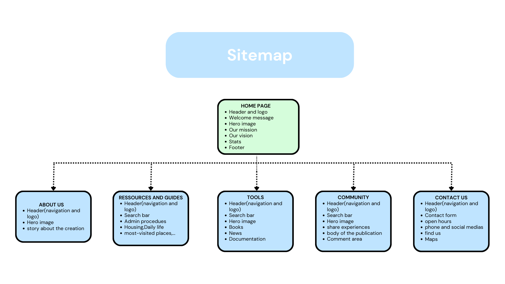

---

##  Timeline and Milestones

| **Milestone**              | **Decomposed Task (Sub-Task)**                                 | **Start Date** | **End Date** | **Duration (Days)** |
|-----------------------------|---------------------------------------------------------------|----------------|--------------| ----------------------|
| **1. Planning & Design**    | Research & Content Analysis                                   | 19 august 2025   | 21 august 2025 | 2                    |
|                             | Finalize Sitemap & Preliminary Wireframes                    | 22 august 2025   | 24 august 2025 | 2                    |
|                             | Design Final Wireframes (Desktop & Mobile)                   | 25 august 2025   | 27 august 2025 | 2                    |
| **2. Front-end Structure (HTML)** | Code HTML for Homepage & 'About Us' pages (Structure only) | 3 Sept 2025   | 6 Sept 2025 | 3                    |
|                             | Code HTML for 'Contact Us' and 'Tools' pages                 | 7 Sept 2025   | 10 Sept 2025 | 3                    |
|                             | Code HTML for 'Resources & Guides' and 'Community' pages     | 13 Sept 2025   | 15 Sept 2025 | 3                    |
| **3. Front-end Style (CSS)** | Code CSS for Homepage & 'About Us' (Base Styling)            | 16 Sept 2025   | 20 Sept 2025 | 2                    |
|                             | Code CSS for Remaining Pages (Styles, Colors, Typography)    | 21 Sept 2025   | 24 Sept 2025 | 3                    |
|                             | Code Responsive Design (Adaptation for all screens)          | 25 Sept 2025   | 28 Sept 2025 | 3                    |
| **4. Simulation & Content** | Add JavaScript Interactions (Menu, buttons, simulated carousel)| 01 Oct 2025 | 06 oct 2025 | 5                    |
|                             | Develop Login Page Prototype (UI and concept explained)      | 07 Oct 2025   | 12 Oct 2025 | 5                    |
|                             | Integrate Final Content (texts, source images, links)        | 13 Oct 2025   | 17 Oct 2025 | 4                    |
| **5. Review & Finalization** | Compatibility Testing and Final Bug Fixes                    | 18 Oct 2025   | 25 Oct 2025 | 3                    |
|                             | Final Report Compilation (POE Part 1) and Submission         | 25 Oct 2025   | 31 Oct 2025 | 6                    |

---

##  Changelog (Initial)
- Added `index.html`, `about.html`, `guide.html`, `gallery.html`, `contact.html`.  
- Created `_image` and `_private` folders.  
- Updated Sitemap.  
- Drafted README.md file.  

---

##  Changelog Update

- Added a **CSS stylesheet** for consistent styling across all pages.  
- Inserted **comments in the code** to explain the structure and functionality of each section.  
- Replaced **hero section images** to better align with the color scheme.  
- Added a **new changelog section** to the README.md.  
- Prepared sections for **screenshots of each web page** in the README.md.  
- Replaced the **Timeline & Milestones** with the requested **tabular format** for clarity.  
- Updated the **References** section into **Harvard Anglia style**, removing bullet points.  
- Confirmed that **references were correctly updated in Harvard Anglia style**.  
- Added **Google Form (as requested)** in the references section.  

---

##  Screenshots (Responsiveness)
**

#### Home Page  

#### About Page  
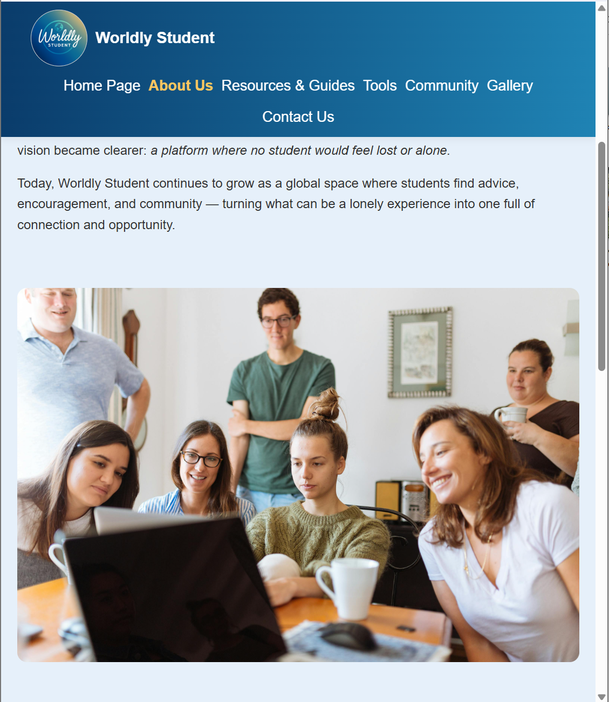
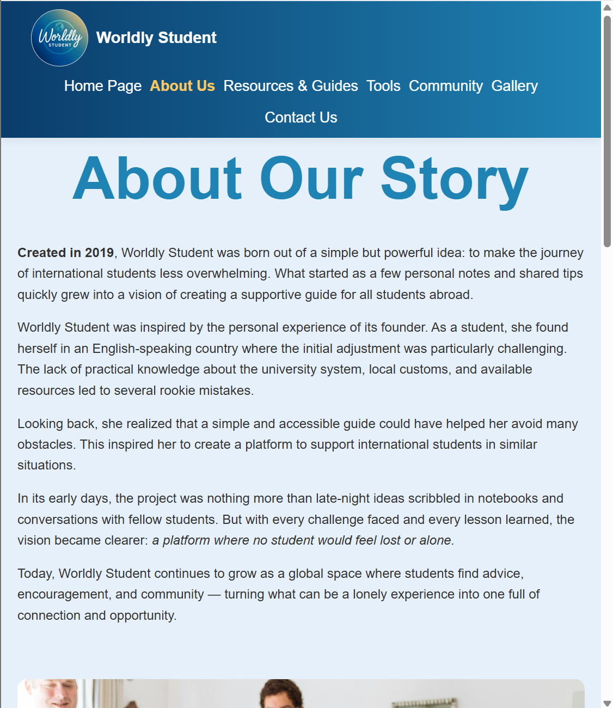

#### Ressources & Guides 
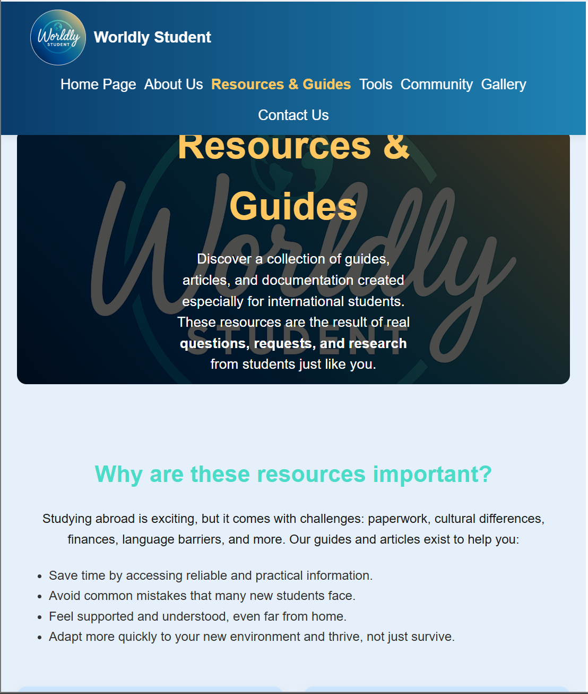
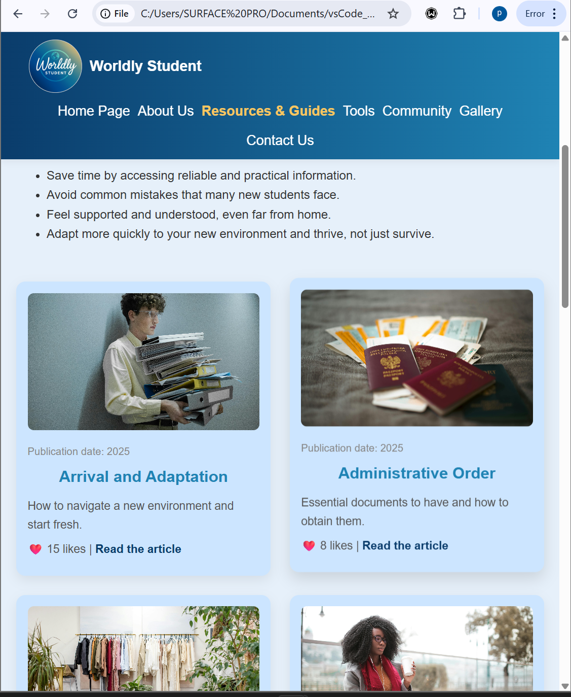

#### Tools  
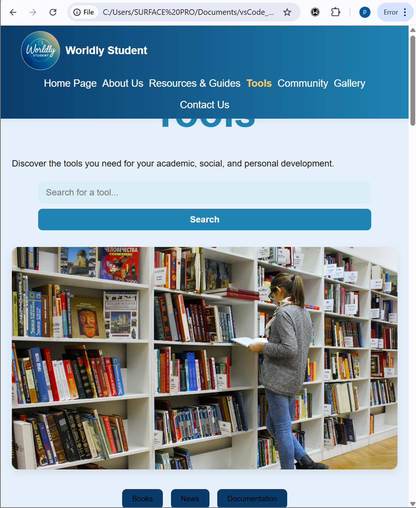
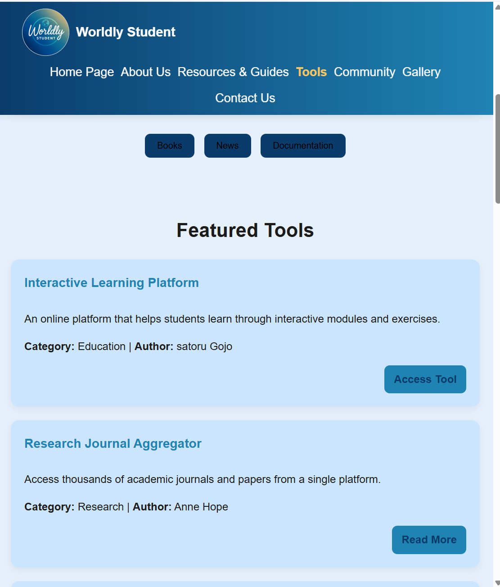

#### community  
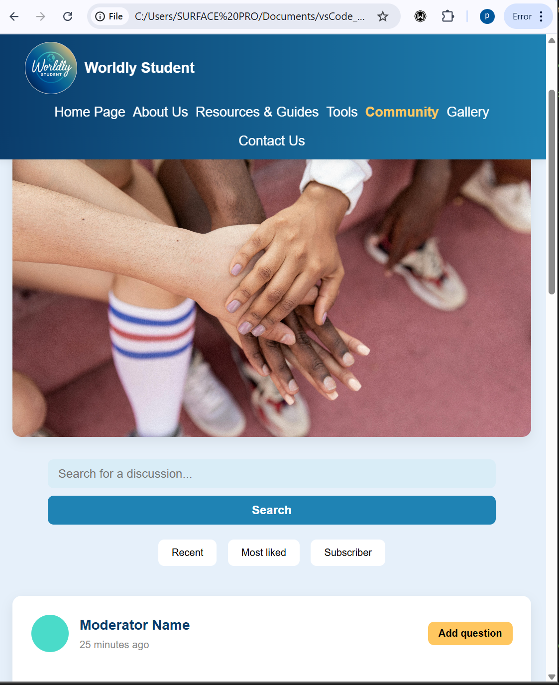

#### Gallery  
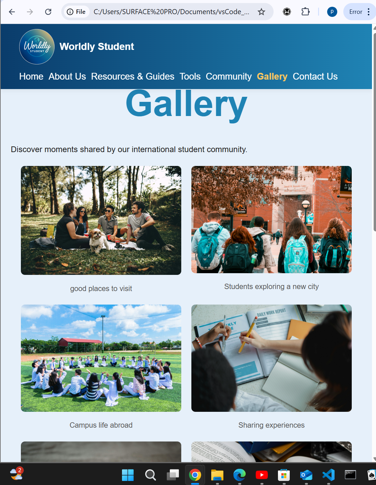

#### Contact us  
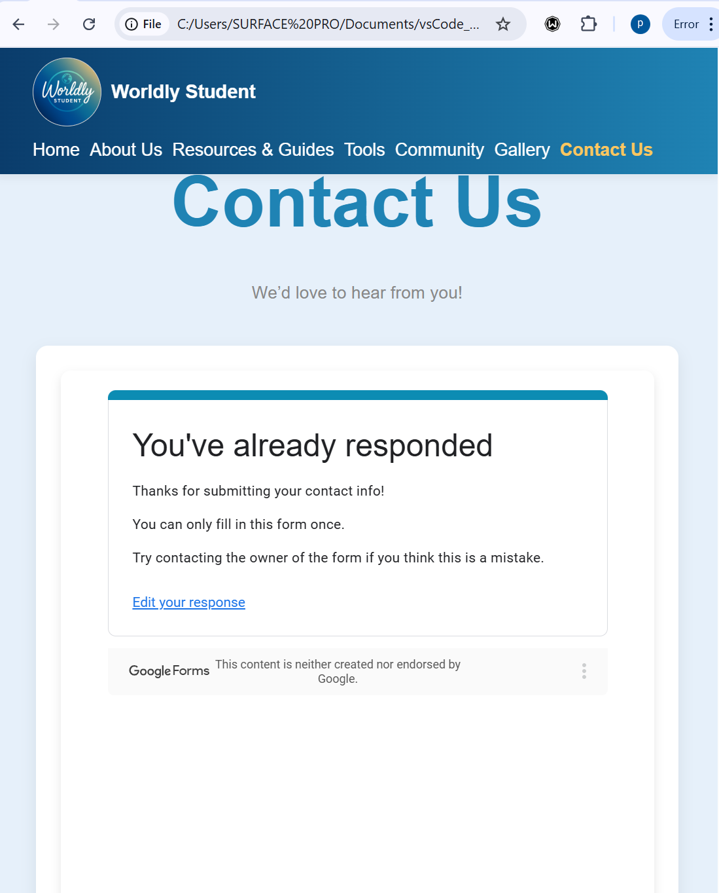
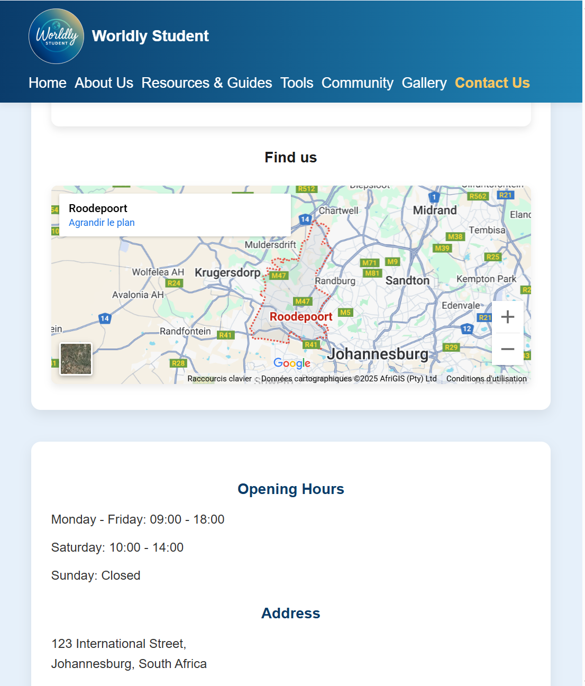

---

##  References
Canva, 2025. *ChatGPT*. [online] Available at: <https://www.canva.com/> [Accessed 27 August 2025].  

Google, 2025. *Google Search*. [online] Available at: <https://www.google.com/> [Accessed 27 August 2025].  

Google, 2025. *Gemini*. [online] Available at: <https://gemini.google.com/app> [Accessed 27 August 2025].  

MDN Web Docs, n.d. *Mozilla Developer Network*. [online] Available at: <https://developer.mozilla.org> [Accessed 27 August 2025].  

Pexels, 2025. *Pexels – Free Stock Photos*. [online] Available at: <https://www.pexels.com/> [Accessed 27 August 2025].  

Wikipedia, 2025. *Wikipedia*. [online] Available at: <https://www.wikipedia.org/> [Accessed 27 August 2025].  

---

##  GitHub Repository
[Worldly Student Repository](https://github.com/ST10498138/worldly_student)  
